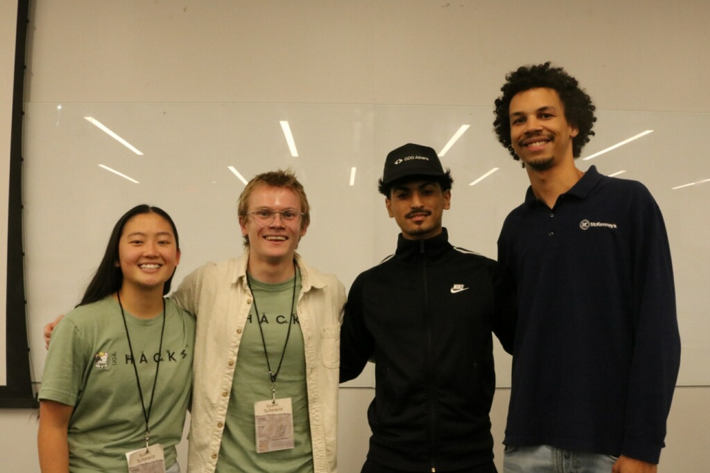

# Ducttape and Hope

## UGA Makeathon 2022

Alex Teal, Emad Aljabry, and Claris Lee
https://devpost.com/software/ducktape-and-hope?ref_content=my-projects-tab&ref_feature=my_projects 

### Goal

To create an accessible method for disabled or immobile patients to control
their internet connected surroundings, using on device voice processing with
REST API integration.

## WE WON

Good work team _Ducttape and Hope_!!!!

Thank you so much to everyone who organized the event, and huge shoutout to
Mckenney's Inc. for organizing the sponsor challenge and letting us compete!

GG Team :D

